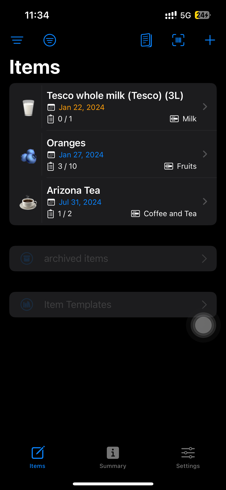
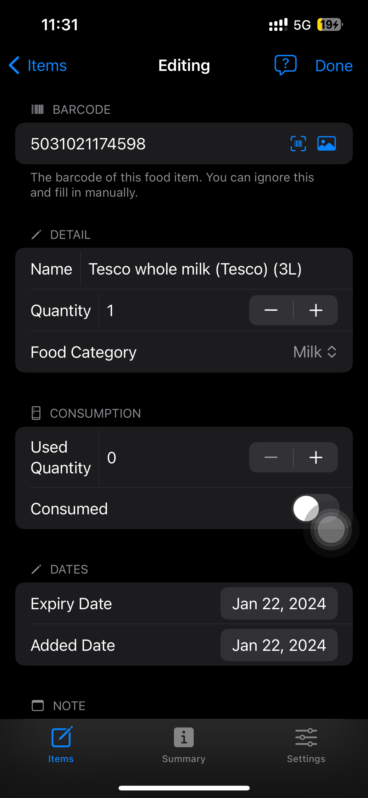
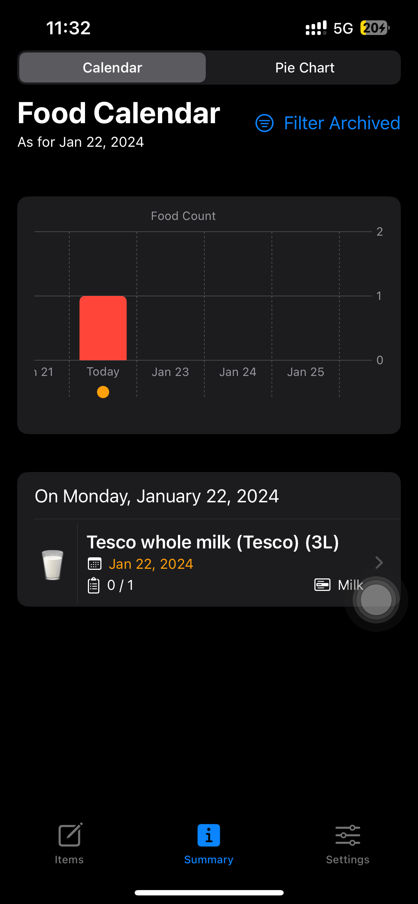
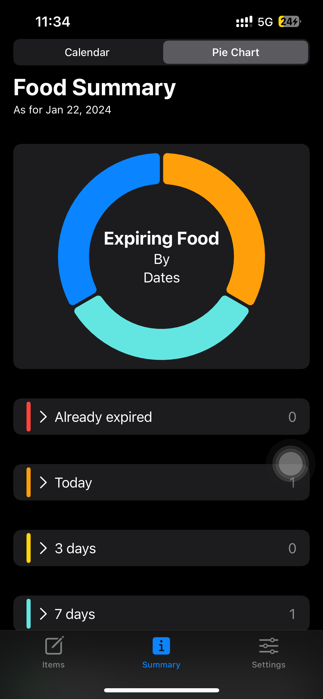

# Food Tracker

This is a simple food expiry tracker app that experiments with the new SwiftData framework and Charts library for SwiftUI.

The application allows the users to scan the QR code of a food item and add it to the expiry tracker. The application will notify the user when on the day when the food expires. The facilitate the recording process, users can enter their OpenAI API key and uses ChatGPT to fill in some of the details for them. 

## Screenshots

   
